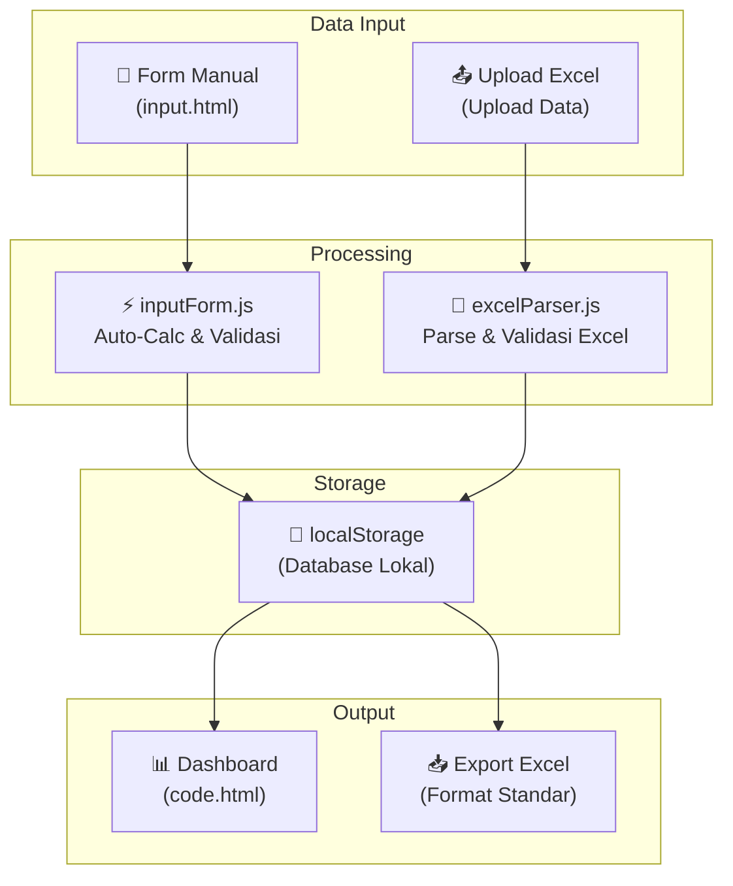
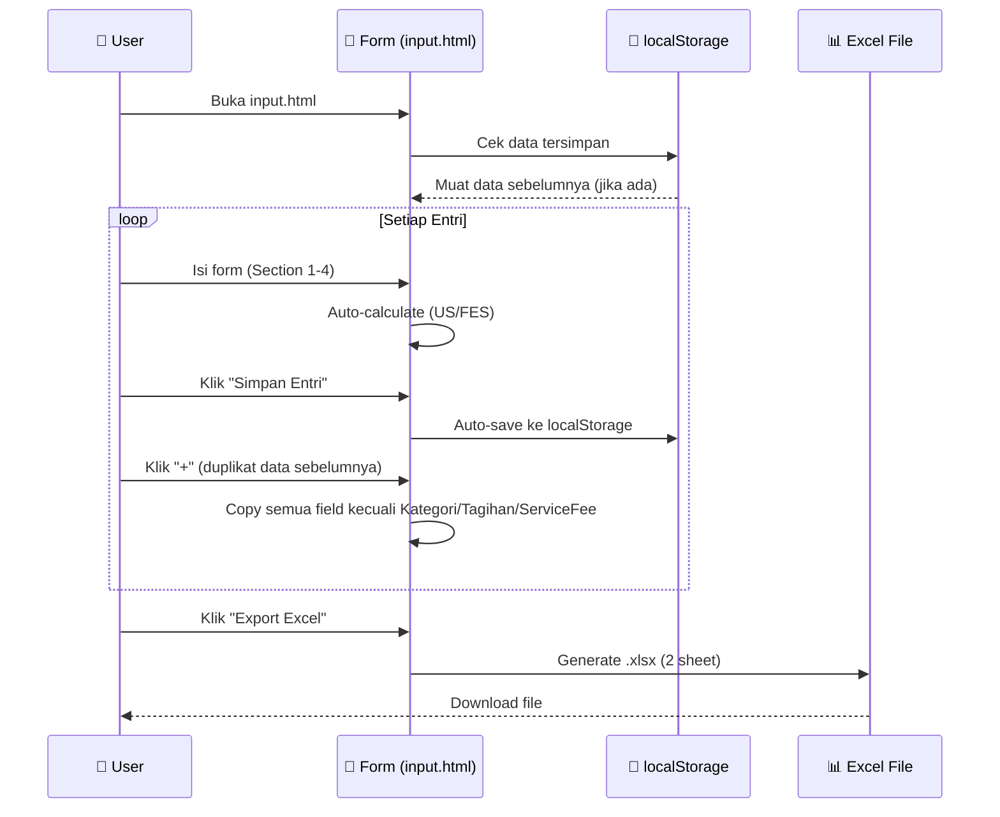

# 🏗️ Alur & Arsitektur Dashboard Umum PTPN IV

## Tujuan Utama
Membangun **Dashboard Rekap Perjalanan Dinas Divisi Umum** PTPN IV — sebuah web app untuk mengelola dan memvisualisasikan data pengeluaran perjalanan dinas (tiket pesawat, hotel, kereta, mobil, per diem, dll).

---

## Arsitektur Sistem



---

## Halaman-Halaman Website

### 1. 📊 Dashboard Utama — `stitch_extracted/code.html`
Halaman utama yang menampilkan ringkasan data perjalanan dinas:
- **Sidebar navigasi** (warna Dark Teal) dengan menu: Dashboard, Upload Data, Laporan, Pengaturan
- **Filter bar** (sticky) — filter berdasarkan Divisi, Bulan, Kategori, Vendor
- **KPI Cards** — Total Pengeluaran, Jumlah Trip, Rata-rata/Trip, dll
- **Chart Visualisasi** — Breakdown per kategori (Pesawat, Hotel, Kereta, dll)
- **Tabel Data** — Detail rekap lengkap

> [!NOTE]
> Halaman dashboard ini masih berupa **mockup statis** dari desain awal (Stitch). Belum terhubung ke data dinamis.

---

### 2. 📝 Form Input Manual — `input.html` ✅ (SUDAH AKTIF)
Halaman yang sudah kita kerjakan bersama. Terdiri dari:

| Section | Konten | Status |
|---------|--------|--------|
| **1. Informasi Umum** | Tahun Anggaran, Cost Center (text), Nomor GL (text), Divisi | ✅ |
| **2. Kategori & Vendor** | Kategori, Vendor (US/FES/Lainnya), No Invoice (wajib), No MPP (opsional) | ✅ |
| **3. Uraian & Tanggal** | Periode, Tgl Berangkat/Kembali, Uraian (rich text editor) | ✅ |
| **4. Nominal & Tagihan** | Tagihan, Service Fee + auto-calculation per vendor | ✅ |

#### Rumus Auto-Calculation per Vendor:

**Vendor US:**

| Field | Rumus |
|-------|-------|
| DPP Service Fee | = 11/12 × Service Fee |
| PPN 12% | = Service Fee × 11% |
| PPH 23 | = 2% × Service Fee |
| Tagihan Service setelah Pajak | = Service Fee + PPN 12% − PPH 23 |
| Jumlah Tagihan | = Tagihan + Service Fee + PPN 12% |
| Yang Dibayarkan | = Jumlah Tagihan − PPH 23 |

**Vendor FES:**

| Field | Rumus |
|-------|-------|
| PPH 23 | = 2% × (Service Fee × Jumlah) |
| Jumlah Tagihan | = (Tagihan × Jumlah) + (Service Fee × Jumlah) |
| Yang Dibayarkan | = Jumlah Tagihan − PPH 23 |

**Vendor Lainnya:** Semua input manual.

---

### 3. 📤 Upload Data (Belum dibangun)
Halaman untuk upload file Excel rekap yang sudah ada.
- Menggunakan `excelParser.js` untuk parse file
- Template tersedia di folder `templates/`:
  - `Template_Standar_Pesawat.xlsx`
  - `Template_Vendor_FES_Pesawat.xlsx`
  - `Template_Vendor_US_Pesawat.xlsx`

---

## File-File Project

```
Dasboard_Umum/
├── input.html                    ← Form input manual (AKTIF)
├── generate_template.js          ← Generator template Excel
│
├── css/
│   └── input-form.css            ← Styling form input
│
├── js/
│   ├── inputForm.js              ← Logika form: validasi, auto-calc, localStorage, export
│   ├── excelParser.js            ← Parser file Excel upload
│   └── pesawatUploadHandler.js   ← Handler khusus upload pesawat
│
├── templates/
│   ├── Template_Standar_Pesawat.xlsx
│   ├── Template_Vendor_FES_Pesawat.xlsx
│   └── Template_Vendor_US_Pesawat.xlsx
│
└── stitch_extracted/
    ├── code.html                 ← Dashboard utama (mockup)
    ├── DESIGN.md                 ← Design system & branding
    └── screen.png                ← Screenshot desain
```

---

## Fitur yang SUDAH Selesai ✅

1. **Form Input Manual** — multi-section, validasi lengkap
2. **Auto-Calculation** — rumus berbeda per vendor (US / FES / Lainnya)
3. **Tabel Ringkasan Rumus** — muncul otomatis saat pilih vendor
4. **Multi-Entry Tabs** — input banyak data dalam satu sesi
5. **Duplikat Entri** — klik `+` otomatis copy data sebelumnya (kecuali Kategori, Tagihan, Service Fee)
6. **Database Lokal (localStorage)** — data persisten meski browser di-refresh
7. **Export Excel** — 2 sheet: Data Rekap (16 kolom standar) + Detail Lengkap (22 kolom)
8. **Preview Table** — lihat semua data yang sudah diinput sebelum export
9. **Edit & Hapus** — bisa edit/hapus per entri dari preview table
10. **Currency Formatting** — format Rp otomatis saat mengetik

---

## Fitur yang BELUM Dibangun ⬜

| No | Fitur | Prioritas | Deskripsi |
|----|-------|-----------|-----------|
| 1 | **Dashboard Utama** | 🔴 Tinggi | Integrasi `code.html` dengan data nyata dari localStorage |
| 2 | **Halaman Upload Excel** | 🔴 Tinggi | UI upload + parsing file Excel |
| 3 | **Navigasi antar halaman** | 🟡 Sedang | Sidebar navigasi yang terhubung ke semua halaman |
| 4 | **Filter & Search** | 🟡 Sedang | Filter data berdasarkan divisi, bulan, kategori, vendor |
| 5 | **Halaman Laporan** | 🟡 Sedang | Cetak/export laporan lengkap |
| 6 | **Chart/Grafik** | 🟡 Sedang | Visualisasi data pengeluaran |
| 7 | **Dark Mode** | 🟢 Rendah | Toggle tampilan gelap |
| 8 | **Backend/Server** | 🟢 Rendah | Database server (saat ini masih localStorage) |

---

## Design System

| Token | Nilai | Penggunaan |
|-------|-------|------------|
| Primary Teal | `#006670` / `#0c616a` | Brand utama, sidebar, header |
| Accent Lime | `#b6d250` | CTA, status positif, highlight |
| Font UI | Inter | Label, navigasi, body text |
| Font Angka | JetBrains Mono | Nominal, currency, tabel data |
| Card Radius | 16px | Semua card/container |
| Button Radius | 12px | Tombol interaktif |
| Shadow | `0 2px 12px rgba(12,97,106,0.08)` | Elevasi card |

---

## Alur Kerja User (Saat Ini)


